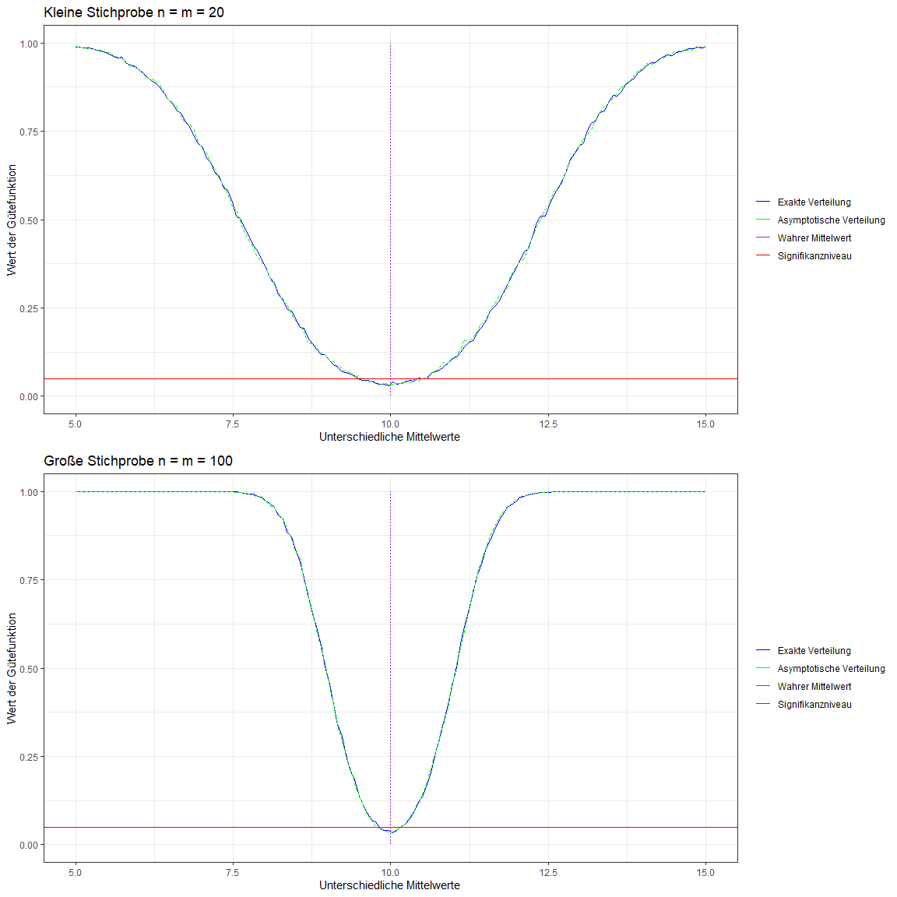
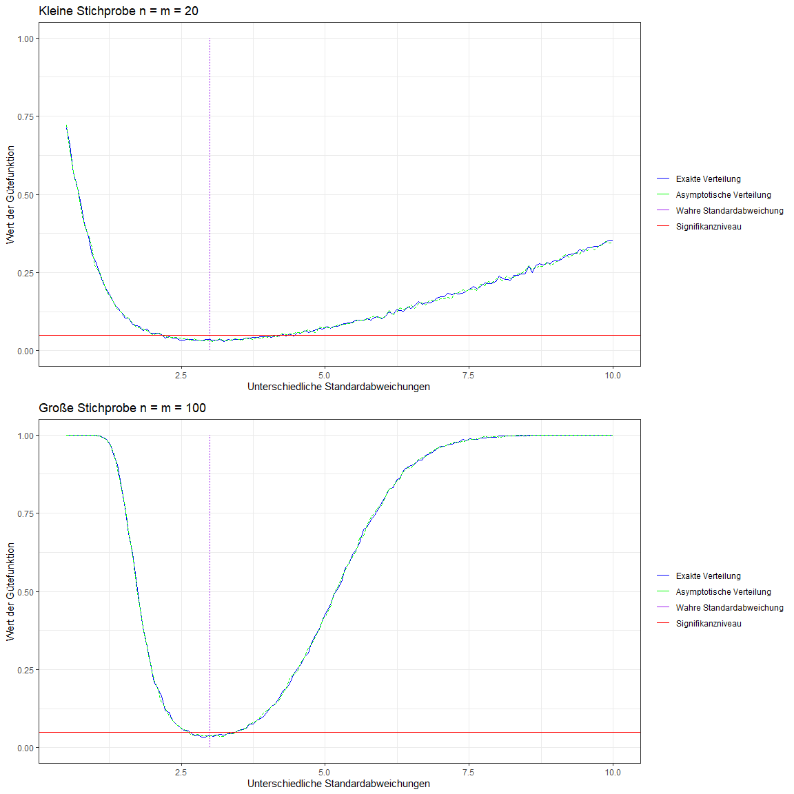

Kolmogorov-Smirnov-Test (zwei Stichproben)
================
Marvin Lob  
[GitHub](https://github.com/malo4300/nichtparametrische_Statistik)
09 Juli, 2022

# Theoretische Eigenschaften des Tests

## Testproblem

Kolmogorov-Smirnov-Test ist ein universell anwendbarer Test. Neben der
Verwendung als Anpassungstest, lässt er sich auch als Test für zwei
unabhängige Stichproben verwenden. Anders als Tests die nur auf Lage-
oder Streuungsalternativen prüfen, vergleicht der Test die empirischen
Verteilungsfunktionen der beiden Stichproben. Dadurch kann er für alle
Alternativen genutzt werden. Ein solcher Test wird als Omnibus-Test
bezeichnet. Seien

und

die Beobachtungen, jeweils unabhängig und identisch verteilt mit

und
.
Die Berechnung der Teststatistik unterliegt der Annahme, dass keine
Bindungen vorliegen, also keine Datenpunkte den gleichen Wert haben. Der
Test ist aber auch dann gültig, wenn Bindungen vorliegen, dann ist der
Test konservativ (Wilcox ([2012](#ref-ties))). Gleiches gilt für den
Fall, dass die Verteilungen diskret und nicht stetig sind. Die
Datengenerierenden-Prozesse sind hier per Annahme Verteilungen mit den
jeweils stetigen Verteilungsfunktionen

und
.
Dabei ergeben sich folgende Testprobleme (Büning and Trenkler
([2013](#ref-BüningTrenkler))):

## Teststatistik

Im Folgenden wird sich auf das zweiseitige Testproblem fokussiert. Zum
einen, da beim zweiseitigen Testen nicht die Kenntnis über die Richtung
einer potenziellen Abweichung angenommen werden muss. Zum anderen, weil
die kritischen Werte im Vergleich zum einseitigen Testen sind. Unter

sollten bei der Berechnung der empirischen Verteilungsfunktionen

und

die Abweichungen auf

gering sein. Ausgedrückt für den zweiseitigen Test definieren wir die
Teststatistik als Supremum der absoluten Abweichung auf
:
Hierbei sind die jeweiligen empirischen Verteilungsfunktionen
erwartungstreue Schätzer für die tatsächlichen Verteilungsfunktionen
(Hafner ([2013](#ref-hafner))). Die Definition der empirischen
Verteilungsfunktion lautet (Büning and Trenkler
([2013](#ref-BüningTrenkler))):

Sei

eine Stichprobe:

## Verteilung der Teststatistik

Aus der Definition der empirischen Verteilungsfunktion ergibt sich, dass
der Wertebereich auf

beschränkt ist. Daraus folgt, dass die Teststatistik, die die
Differenzen von

und

betrachtet, zum einen auch nur endlich viele Werte annehmen kann. Zum
anderen, dass die Ausprägung von der relativen Position der

und

abhängen. In anderen Worten, die Teststatistik hängt von den Rängen der

und

in der gemeinsamen Stichprobe ab. Sie ist demnach verteilungsfrei
(Gibbons and Chakraborti ([2014](#ref-gibbons))) und ergibt sich daraus,
in welcher Reihenfolge

und

Beobachtungen auftreten.

### Exakte Verteilung

Unter

(die Verteilungsfunktionen sind gleich) sind alle möglichen
Permutationen der gemeinsamen Stichprobe, also wie

und

geordnet sind gleich wahrscheinlich und die kritischen Werte

lassen sich durch auszählen bestimmen. Für die beispielhaften
Stichprobenumfänge

ergeben sich

unterschiedliche Permutationen, beispielsweise

für welche

ist. Für die unterschiedlichen Ausprägungen von

ergeben sich unter

bei der oben genannten Stichprobengröße folgende
Auftretenswahrscheinlichkeiten:

Das Beispiel ist stark von einer Veranschaulichung aus dem Buch
Nichtparametrische statistische Methoden (Büning and Trenkler
([2013](#ref-BüningTrenkler))) adaptiert. Es wird schnell ersichtlich,
dass es aufgrund der diskreten Verteilung der Teststatistik nicht immer
möglich ist, gewünschte Siginfikanzniveaus wie beispielsweise

auszuschöpfen beziehungsweise überhaupt zu erreichen. Der kritische Wert
wird dann wenn möglich so gewählt, dass der Test konservativ wird, also
weniger oft ablehnt. Dieses Phänomen wird auch bei der kommenden
Monte-Carlo-Simulation ersichtlich.

### Asymptotische Verteilung

Da die genaue Verteilung schon bei eigentlich kleinen
Stichprobenumfängen von

aufwendig auszurechnen ist (bei

sind es

viele Permutationen) wurde eine asymptotische Verteilung bestimmt (Capon
([1965](#ref-Asymptotic))):

Für alle

gilt

Durch diese asymptotische Verteilung lässt sich für berechnete

und endlicher Stichprobengrößen die approximative Wahrscheinlichkeit
berechnen, unter

eine Teststatistik zu beobachten. Die asymptotische Verteilung kann also
dazu genutzt werden, um den p-Wert zu approximieren, weshalb ich diese
Wahrscheinlichkeit im Folgenden als

bezeichnen werde.

wird nun bestimmt, indem man 1 minus die approximative
Wahrscheinlichkeit () rechnet. Dabei steigt die Genauigkeit mit den
Stichprobengrößen
.
Die Summanden konvergieren für große

sehr schnell gegen Null, weshalb bei der Implementierung als Funktion
für die Anwendung eine trunkierte Summe genutzt werden kann.

## Testdurchführung

Bei der allgemeinen Testdurchführung wird nun

berechnet und mit dem

Quantil verglichen. Gilt nun

so wird

verworfen. Für den oben berechneten Fall

ist das kleinste mögliche

und der dazu gehörige kritische Wert lautet
.

wird also für ein

zu diesem
-Niveau
abgelehnt. Aufgrund der am Beispiel vorgerechneten kleinen
Stichprobenumfänge und dem daraus resultierenden hohen Signifikanzniveau
ist hier ein Test nur wenig aussagekräftig. Bei der Testdurchführung
mithilfe der asymptotische Verteilung wird für die endlichen Stichproben
die approximative Wahrscheinlichkeit
,
eine Teststatistik unter

zu beobachteten, berechnet. Dabei wird

genau dann verworfen, wenn die berechnete Wahrscheinlichkeit kleiner als
das festgelegte Signifikanzniveau ist, also wenn
.

Der hier betrachtete zweiseitige Test ist nicht unverfälscht. Das
bedeutet, dass für bestimmte Parameter aus der Menge der Alternativen
und Stichprobengrößen der Fehler erster Art
(
wird fälschlicherweise abgelehnt) größer ist, als die Wahrscheinlichkeit
bestimmte Alternativen zu verwerfen. Der einseitige Test ist jedoch
unverfälscht (Büning and Trenkler ([2013](#ref-BüningTrenkler))).

# Monte-Carlo-Simulation

Die Gütefunktion eines Test
")
gibt die Wahrscheinlichkeit an, dass

abgelehnt wird. Sie lässt sich durch eine Monte-Carlo-Simulation
approximieren. Unter bestimmten Stichprobengrößen und Signifikanzniveaus
kann die asymptotische Verteilung für die Approximation der Gütefunktion
genau die gleichen Ergebnisse wie die exakte Verteilung liefern. Dies
hat zwei Gründe:

1.  Die Teststatistik ist diskret und deshalb ist der p-Wert auch
    diskret. Das Signifikanzniveau wird beim Testen also nicht unbedingt
    voll ausgeschöpft.

2.  Die Gütefunktion betrachtet nur, ob der Test ablehnt oder nicht.
    Abweichungen im p-Wert zwischen exakter und asymptotische Verteilung
    können also für beobachtete Teststatistiken
    
    “irrelevant” sein, wenn beide p-Werte unter oder über dem
    Signifikanzniveau
    
    liegen. Dies kann für bestimmte Werte
    
    eintreten.

## Monte-Carlo-Simulation Code

Der folgende Code approximiert die Gütefunktion für das zweiseitige
Zweistichproben-Problem für die gegebenen Stichprobenumfänge

und
,
unter der Nullhypothese, dass die Verteilungen identisch versus, dass
die Verteilungen nicht identisch sind. Dabei betrachte ich verschiedene
Verletzungen der Nullhypothese. Bei der Monte-Carlo-Simulation
konzentriere ich mich auf die Abweichung im Mittelwert und in der
Standardabweichung zweier normalverteilten Zufallsvariablen

und
.
Aufgrund der Verteilungsfreiheit des Tests könnten hier aber auch
beliebig andere, im Rahmen der Annahmen befindlichen, Verteilungen
genutzt werden. Insbesondere wird auch die exakte und asymptotische
Verteilung der Teststatistik verglichen.

Für die Approximation werden für den Mittelwert und die
Standardabweichung jeweils 150 um den wahren Parameter liegende
Abweichungen generiert. Dabei werden für jede Abweichung 5000
Stichproben der Größe

und

gezogen und der Kolmogorov-Smirnov-Test zu einem Signifikanzniveau von

durchgeführt. Sei

die Anzahl der 5000 Stichproben bei denen der Test ablehnt, dann ergibt
sich die approximative Gütefunktion als
 = \frac{\gamma}{5000}").
Aufgrund der diskreten Verteilung von

wird das Signifikanzniveau für bestimmte

wie bereits erwähnt nicht unbedingt ausgeschöpft.

``` r
#Wahre Parameter
p_value = 0.05
mean_true = 10
sd_true = 3
B = 5000
#Grid für unterschiedliche Abweichungen von H0
grid_mean = seq(5,15, length.out = 150)
grid_sd = seq(0.5,10, length.out = 150)
##### Exakte Verteilung #####
####Abweichung im Mittelwert exakte Verteilung des Test####
#Kleine Stichprobe
n = m = 20
#Approximative Gütefunktion
power_small_exact_mean = rep(0, length(grid_mean))
for (H_0_Version in 1:length(grid_mean)) {
  test_results = rep(TRUE, B)
  for (i in 1:B) {
    x = rnorm(n = m, mean = mean_true, sd = sd_true)
    y = rnorm(n = n, mean = grid_mean[H_0_Version], sd = sd_true)
    test_results[i] = ks.test(x,y,alternative = "two.sided", exact = T)$p.value < p_value
  }
  power_small_exact_mean[H_0_Version] = (sum(test_results)/B)
}

#Große Stichprobe
n = m = 100
#Approximative Gütefunktion
power_big_exact_mean = rep(0, length(grid_mean))
for (H_0_Version in 1:length(grid_mean)) {
  test_results = rep(TRUE, B)
  for (i in 1:B) {
    x = rnorm(n = m, mean = mean_true, sd = sd_true)
    y = rnorm(n = n, mean = grid_mean[H_0_Version], sd = sd_true)
    test_results[i] = ks.test(x,y,alternative = "two.sided", exact = T)$p.value < p_value
  }
  power_big_exact_mean[H_0_Version] = (sum(test_results)/B)
}

####Abweichung in der Standardabweichung exakte Verteilung des Test ####
#Kleine Stichprobe
n = m = 20
#Approximative Gütefunktion
power_small_exact_sd = rep(0, length(grid_sd))

for (H_0_Version in 1:length(grid_sd)) {
  test_results = rep(TRUE, B)
  for (i in 1:B) {
    x = rnorm(n = m, mean = mean_true, sd = sd_true)
    y = rnorm(n = n, mean = mean_true, sd = grid_sd[H_0_Version])
    test_results[i] = ks.test(x,y,alternative = "two.sided", exact = T)$p.value < p_value
  }
  power_small_exact_sd[H_0_Version] = (sum(test_results)/B)
}
#Große Stichprobe
n = m = 100
#Approximative Gütefunktion
power_big_exact_sd = rep(0, length(grid_sd))
set.seed(100)
for (H_0_Version in 1:length(grid_sd)) {
  test_results = rep(TRUE, B)
  for (i in 1:B) {
    x = rnorm(n = m, mean = mean_true, sd = sd_true)
    y = rnorm(n = n, mean = mean_true, sd = grid_sd[H_0_Version])
    test_results[i] = ks.test(x,y,alternative = "two.sided", exact = T)$p.value < p_value
  }
  power_big_exact_sd[H_0_Version] = (sum(test_results)/B)
}
##### Asymptotische Verteilung #####
#Funktion die angibt, wie wahrscheinlich eine extremere Teststatistik asymptotisch ist
asy_dist = function(d_beob, n, m){
  lampda_beob = sqrt((n*m)/(n+m))*d_beob
  prob = 1
  ### Summe bis 100 trunkiert
  for (i in 1:100) {
    prob = prob - 2*((-1)^(i-1))*exp((-2)*(lampda_beob^2)*(i^2))
  }
  return(1-prob) #Wahrscheinlichkeit einen extremeren Wert zu sehen
}
####Abweichung im Mittelwert asymptotische Verteilung des Test
#Kleine Stichprobe
n=m=20
#Approximative Gütefunktion
power_small_asy_mean = rep(0, length(grid_mean))
for (H_0_Version in 1:length(grid_mean)) {
  test_results = rep(TRUE, B)
  for (j in 1:B) {
    d_beob = 
      ks.test(x = rnorm(n = n, mean = mean_true, sd = sd_true),
              y = rnorm(n = m, mean = grid_mean[H_0_Version], sd = sd_true))$statistic
    p_value_asy = asy_dist(d_beob = d_beob, n = n, m = m)
    test_results[j] = p_value_asy < 0.05
  }
  power_small_asy_mean[H_0_Version] = (sum(test_results)/B)
}

#Große Stichprobe
n=m=100
#Approximative Gütefunktion
power_big_asy_mean = rep(0, length(grid_mean))
for (H_0_Version in 1:length(grid_mean)) {
  test_results = rep(TRUE, B)
  for (j in 1:B) {
    d_beob = 
      ks.test(x = rnorm(n = n, mean = mean_true, sd = sd_true),
              y = rnorm(n = m, mean = grid_mean[H_0_Version], sd = sd_true))$statistic
    p_value_asy = asy_dist(d_beob = d_beob, n = n, m = m)
    test_results[j] = p_value_asy < 0.05
  }
  power_big_asy_mean[H_0_Version] = (sum(test_results)/B)
}
####Abweichung in der Standardabweichung asymptotische Verteilung des Test###
#Kleine Stichprobe
n=m=20
#Approximative Gütefunktion
power_small_asy_sd = rep(0, length(grid_sd))
for (H_0_Version in 1:length(grid_sd)) {
  test_results = rep(TRUE, B)
  for (j in 1:B) {
    d_beob = 
      ks.test(x = rnorm(n = n, mean = mean_true, sd = sd_true),
              y = rnorm(n = m, mean = mean_true, sd = grid_sd[H_0_Version]))$statistic
    p_value_asy = asy_dist(d_beob = d_beob, n = n, m = m)
    test_results[j] = p_value_asy < 0.05
  }
  power_small_asy_sd[H_0_Version] = (sum(test_results)/B)
}
#Große Stichprobe
n=m=100
#Approximative Gütefunktion
power_big_asy_sd = rep(0, length(grid_sd))
for (H_0_Version in 1:length(grid_sd)) {
  test_results = rep(TRUE, B)
  for (j in 1:B) {
    d_beob = 
      ks.test(x = rnorm(n = n, mean = mean_true, sd = sd_true),
              y = rnorm(n = m, mean = mean_true, sd = grid_sd[H_0_Version]))$statistic
    p_value_asy = asy_dist(d_beob = d_beob, n = n, m = m)
    test_results[j] = p_value_asy < 0.05
  }
  power_big_asy_sd[H_0_Version] = (sum(test_results)/B)
}
```

## Grafiken erstellen

Die approximative Gütefunktion wird im Folgenden grafisch dargestellt.
Die Grafiken wurden mit dem Tidyverse-Package (Wickham et al.
([2019](#ref-tidy))) erstellt. Dabei wird die exakte und asymptotische
Verteilung für einen gegeben Stichprobenumfang in einer Grafik gegenüber
gestellt.

``` r
plot_mean_small = 
  ggplot(data = data.frame(grid_mean ,power_small_exact_mean, power_small_asy_mean),
         mapping = aes(x = grid_mean))+
  geom_line(mapping = 
              aes(y = power_small_exact_mean,  colour = "Exakt", linetype = "dashed"))+
  geom_line(mapping = 
              aes(y = power_small_asy_mean, colour = "Asymptotisch", linetype = "dotted"))+ 
  geom_line(mapping = aes(x = 10, y = seq(0,1, length.out = 150), 
                          colour = "Mean",linetype = "dotdash"))+
  geom_hline(mapping = aes(yintercept = 0.05 , colour = "alpha")) +
  scale_colour_manual("",
    labels = c("Exakte Verteilung", "Asymptotische Verteilung",
               "Wahrer Mittelwert", "Signifikanzniveau"),
    breaks = c("Exakt","Asymptotisch", "Mean", "alpha"),
    values = c("Blue", "Green", "Purple", "Red")) +
  scale_linetype_discrete(guide = "none")+
  theme_bw()+
  xlab("Unterschiedliche Mittelwerte") +
  ylab("Wert der Gütefunktion") +
  ggtitle("Kleine Stichprobe n = m = 20") +
  ylim(0,1) 

plot_mean_big = 
  ggplot(data = data.frame(grid_mean ,power_big_exact_mean, power_big_asy_mean), 
                       mapping = aes(x = grid_mean))+
  geom_line(mapping = 
              aes(y = power_big_exact_mean,  colour = "Exakt",  linetype = "dashed"))+
  geom_line(mapping = 
              aes(y = power_big_asy_mean, colour = "Asymptotisch", linetype = "dotted"))+ 
  geom_line(mapping = aes(x = 10, y = seq(0,1, length.out = 150), 
                          colour = "Mean",linetype = "dotdash"))+
  geom_hline(mapping = aes(yintercept = 0.05 , colour = "alpha")) + 
  scale_colour_manual("",
    labels = c("Exakte Verteilung", "Asymptotische Verteilung",
               "Wahrer Mittelwert", "Signifikanzniveau"), 
    breaks = c("Exakt","Asymptotisch", "Mean", "alpha" ),
    values = c("Blue", "Green", "Purple", "Red"))+ 
  scale_linetype_discrete(guide = "none")+ 
  theme_bw()+
  xlab("Unterschiedliche Mittelwerte") +
  ylab("Wert der Gütefunktion") +
  ggtitle("Große Stichprobe n = m = 100") +
  ylim(0,1)

plot_sd_small = 
  ggplot(data = data.frame(grid_sd, power_small_exact_sd,power_small_asy_sd), 
                       mapping = aes(x = grid_sd))+
  geom_line(mapping = 
              aes(y = power_small_exact_sd,  colour = "Exakt", linetype = "dashed"))+
  geom_line(mapping = 
              aes(y = power_small_asy_sd, colour = "Asymptotisch", linetype = "dotted"))+
  geom_line(mapping = aes(x = 3, y = seq(0,1, length.out = 150), 
                          colour = "SD",linetype = "dotdash"))+
  geom_hline(mapping = aes(yintercept = 0.05 , colour = "alpha"))+
  scale_colour_manual("",
    labels = c("Exakte Verteilung", "Asymptotische Verteilung",
               "Wahre Standardabweichung", "Signifikanzniveau"), 
    breaks = c("Exakt","Asymptotisch", "SD", "alpha" ),
    values = c("Blue", "Green", "Purple", "Red")) +
  scale_linetype_discrete(guide = "none") + 
  theme_bw()+
  xlab("Unterschiedliche Standardabweichungen") +
  ylab("Wert der Gütefunktion")+
  ggtitle("Kleine Stichprobe n = m = 20")+
  ylim(0,1)

plot_sd_big = 
  ggplot(data = data.frame(grid_sd, power_big_exact_sd,power_big_asy_sd), 
                     mapping = aes(x = grid_sd))+
  geom_line(mapping = aes(y = power_big_exact_sd,  
                          colour = "Exakt", linetype = "dashed"))+
  geom_line(mapping = aes(y = power_big_asy_sd, 
                          colour = "Asymptotisch", linetype = "dotted"))+
  geom_line(mapping = aes(x = 3, y = seq(0,1, length.out = 150), 
                          colour = "SD",linetype = "dotdash"))+
  geom_hline(mapping = aes(yintercept = 0.05 , colour = "alpha"))+
  scale_colour_manual("",
    labels = c("Exakte Verteilung", "Asymptotische Verteilung",
               "Wahre Standardabweichung", "Signifikanzniveau"), 
    breaks = c("Exakt","Asymptotisch", "SD", "alpha" ),
    values = c("Blue", "Green", "Purple", "Red")) + 
  scale_linetype_discrete(guide = "none")+
  theme_bw()+
  xlab("Unterschiedliche Standardabweichungen") +
  ylab("Wert der Gütefunktion")+
  ggtitle("Große Stichprobe n = m = 100")+
  ylim(0,1)
```

## Grafiken plotten

### Vergleich bei Abweichung im Mittwelwert für exakte und asymptotische Verteilung für unterschiedliche Stichprobengrößen


\### Vergleich bei Abweichung der Standardabweichung für exakte und
asymptotische Verteilung für unterschiedliche Stichprobengrößen


# Fazit

Die Monte-Carlo-Simulation der Gütefunktion gibt erste Hinweise auf die
Stärke des Tests. So wird ersichtlich, dass sowohl bei Abweichungen im
Mittelwert als auch bei der Standardabweichung der Test bei höheren
Stichprobenumfängen schärfer wird, ein erster Indiz für Konsistenz.
Außerdem scheint der Test Probleme damit zu haben, eine höhere
Standardabweichung in einer der beiden Verteilungen zu erkennen. Das ist
aufgrund der durch die höhere Varianz induzierten Variabilität in den
Permutation der Stichproben aber auch erwartbar. Unabhängig von der Art
des Unterschieds der Verteilungen zeigen die Simulationen mit den großen
Stichprobenumfängen, dass die Gütefunktion des Test bei der Verletzungen
der Nullhypothese für hinreichend hohe Abweichungen gegen 1 geht, der
Test also die Abweichungen (fast) immer erkennt. Der Unterschied
zwischen der exakten und asymptotischen Verteilung scheint
vernachlässigbar, auch das stellt nach den Diskussionen zu Beginn von
[Abschnitt 2](#MS) keine große Überraschung dar.

Abschließend lässt sich unter anderem durch die hier skizzierten
unterschiedlichen Anwendungsmöglichkeiten und die diskutierte Robustheit
des Tests, selbst bei Abweichungen von den Annahmen, der große generelle
Nutzen des Kolmogorov-Smirnov-Test erahnen.

# Literaturverzeichnis

<div id="refs" class="references csl-bib-body hanging-indent">

<div id="ref-BüningTrenkler" class="csl-entry">

Büning, Herbert, and Götz Trenkler. 2013. *Nichtparametrische
Statistische Methoden*. De Gruyter.
<https://doi.org/doi:10.1515/9783110902990>.

</div>

<div id="ref-Asymptotic" class="csl-entry">

Capon, Jack. 1965. “On the Asymptotic Efficiency of the
Kolmogorov-Smirnov Test.” *Journal of the American Statistical
Association* 60 (311): 843–53. <http://www.jstor.org/stable/2283250>.

</div>

<div id="ref-gibbons" class="csl-entry">

Gibbons, Jean Dickinson, and Subhabrata Chakraborti. 2014.
*Nonparametric Statistical Inference*. CRC press.

</div>

<div id="ref-hafner" class="csl-entry">

Hafner, Robert. 2013. *Nichtparametrische Verfahren Der Statistik*.
Springer-Verlag.

</div>

<div id="ref-tidy" class="csl-entry">

Wickham, Hadley, Mara Averick, Jennifer Bryan, Winston Chang, Lucy
D’Agostino McGowan, Romain François, Garrett Grolemund, et al. 2019.
“Welcome to the <span class="nocase">tidyverse</span>.” *Journal of Open
Source Software* 4 (43): 1686. <https://doi.org/10.21105/joss.01686>.

</div>

<div id="ref-ties" class="csl-entry">

Wilcox, Rand. 2012. “Chapter 5 - Comparing Two Groups.” In *Introduction
to Robust Estimation and Hypothesis Testing (Third Edition)*, edited by
Rand Wilcox, Third Edition, 137–213. Statistical Modeling and Decision
Science. Boston: Academic Press.
https://doi.org/<https://doi.org/10.1016/B978-0-12-386983-8.00005-6>.

</div>

</div>
